# 代码逻辑梳理

本文档用于说明项目的运行逻辑、模块边界、外设控制方式和主要数据流。README 更偏向项目使用方式；本文更偏向读代码和维护代码时的结构说明。

文档中的图使用 Mermaid 语法；如果 Markdown 预览器不渲染 Mermaid，仍可以阅读图前后的文字说明。

## 总体分层

项目主要分为三层：

- `Core/`：STM32CubeMX 生成的 HAL 初始化代码，包括时钟、GPIO、CAN、I2C、USART、TIM、中断入口等。
- `Bsp/`：板级外设驱动层，封装电机、底盘、里程计、IMU、红外传感器、吸力电机、串口发送等底层能力。
- `App/`：应用逻辑层，负责底盘任务状态机和上位机串口协议。

模块关系图：

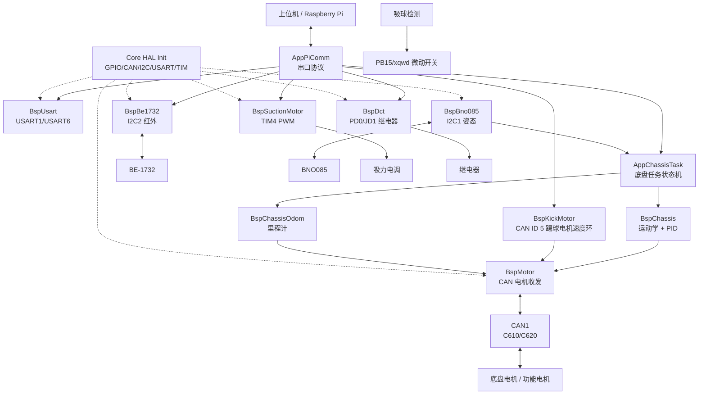

核心执行链路：

```text
main()
  -> MX_*_Init()
  -> BspMotor_Init()
  -> BspKickMotor_Init()
  -> BspSuctionMotor_Init()
  -> BspSuctionDetect_Init()
  -> BspBe1732_Init()
  -> BspDct_Init()
  -> AppChassisTask_Init()
  -> AppPiComm_Init()
  -> Bno085_Init() / Bno085_EnableDefaultReports()
  -> while (1)
       -> AppPiComm_Task()
       -> Bno085_ReadSensorData()
       -> BNO_KEY 短按/长按处理
       -> AppChassisTask_Task()
       -> BspKickMotor_Task()
       -> BspSuctionMotorTest_Task()
       -> AppPiComm_Task()
```

## 主循环逻辑

主入口在 `Core/Src/main.c`。

初始化阶段：

- `MX_GPIO_Init()`：初始化 GPIO，包括按键、外设引脚等。
- `MX_CAN1_Init()`：初始化 CAN1，用于 C610/C620 电调通信。
- `MX_USART1_UART_Init()`：初始化 USART1，当前主要作为调试输出口。
- `MX_USART6_UART_Init()`：初始化 USART6，上位机串口命令走这个口。
- `MX_I2C1_Init()`：初始化 I2C1，用于 BNO085。
- `MX_TIM4_Init()`：初始化 TIM4 PWM，用于吸力电机信号。
- `MX_I2C2_Init()`：初始化 I2C2，用于 BE-1732 红外传感器。
- `BspMotor_Init()`：配置 CAN 滤波器、启动 CAN、打开 FIFO0 接收中断。
- `BspKickMotor_Init()`：初始化 CAN ID 5 踢球电机控制状态，并发送一次 0 电流。
- `BspSuctionMotor_Init()`：启动 TIM4 CH1 PWM，并输出初始化脉宽。
- `BspSuctionDetect_Init()`：初始化吸球检测 BSP，GPIO 配置由 CubeMX 的 `MX_GPIO_Init()` 完成。
- `BspBe1732_Init()`：恢复 I2C2 总线、检查设备、默认切换到调制检测模式。
- `BspDct_Init()`：关闭 PD0/JD1 继电器输出。
- `AppChassisTask_Init()`：初始化底盘任务状态机。
- `AppPiComm_Init()`：启动 USART6 单字节中断接收。
- `Bno085_Init()`：初始化 BNO085，并开启默认姿态/陀螺仪报告。

循环阶段每轮做的事：

1. 调用 `AppPiComm_Task()`，处理串口6已经收到的命令。
2. 调用 `Bno085_ReadSensorData()`，读取 IMU 数据。
3. 如果有旋转向量数据，更新 `bno085_yaw_deg` 和 yaw 更新时间。
4. 如果有陀螺仪数据，更新 `bno085_gyro_z_deg_s` 和 gyro 更新时间。
5. 扫描 `BNO_KEY`，去抖后区分短按/长按：短按 yaw 归零，长按切换底盘运动使能。
6. 根据 yaw/gyro 更新时间判断数据是否有效。
7. 调用 `AppChassisTask_Task()`，根据当前底盘状态输出电机控制。
8. 调用 `BspKickMotor_Task()`，按串口给定速度/方向更新 5 号踢球电机电流。
9. 调用 `BspSuctionMotorTest_Task()`，保留吸力电机测试任务。
10. 再调用一次 `AppPiComm_Task()`，降低串口命令处理延迟。
11. `HAL_Delay(MAIN_LOOP_DELAY_MS)`。

主循环调度图：

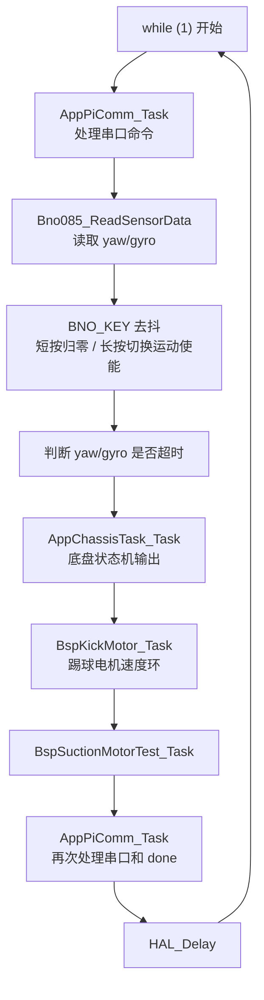

## 串口协议逻辑

串口协议在 `App/Src/app_pi_comm.c`，通信口固定为 `USART6`。

接收方式：

- `AppPiComm_Init()` 调用 `HAL_UART_Receive_IT(&huart6, ..., 1)` 启动单字节中断接收。
- `HAL_UART_RxCpltCallback()` 中只把字节放进环形缓冲区，然后重新开启下一次接收。
- `AppPiComm_Task()` 在主循环中从环形缓冲区取字节，按 `\n` 拼成完整命令行。
- 命令过长会回复 `err long *CRC`。

命令格式：

```text
payload *CRC16
```

处理流程：

```text
USART6 RX 中断
  -> app_pi_rx_ring
  -> AppPiComm_Task()
  -> ProcessLine()
  -> ValidateAndSplitCrc()
  -> 按 cmd_xxx 分发
  -> 执行 App/BSP 接口
  -> SendPayloadWithCrc()
```

串口命令处理图：

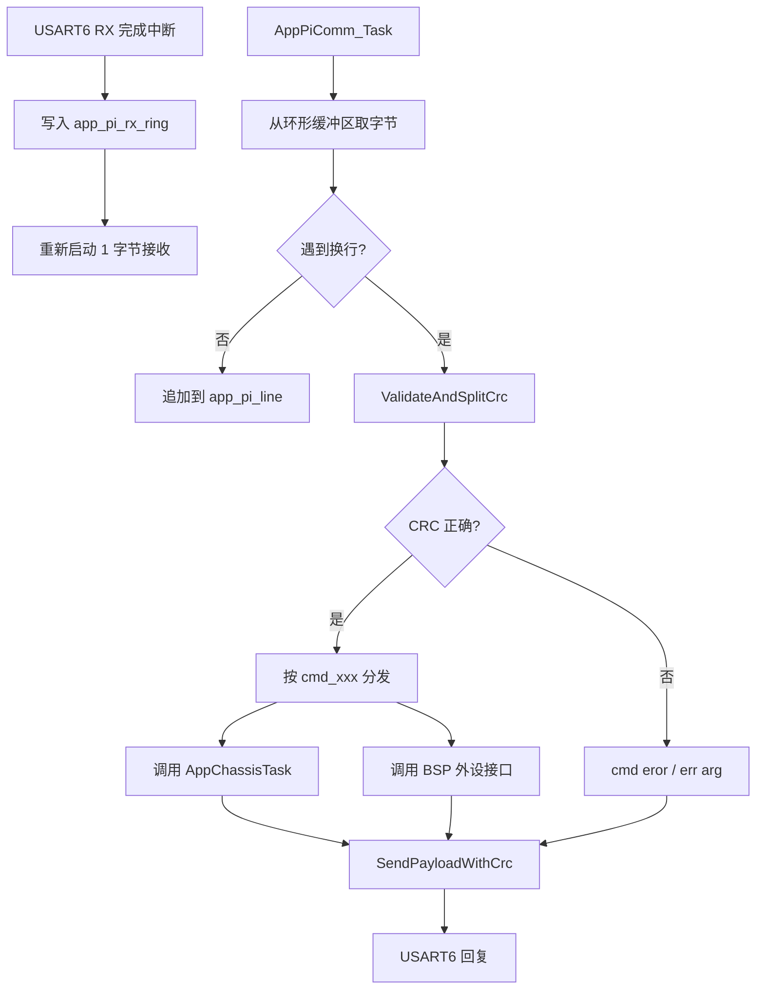

CRC 使用 CRC16-CCITT，初值 `0xFFFF`，计算范围是 `*` 前面的 payload，不包含空格后的 `*CRC`。

主要命令：

- `cmd_dis x y`：相对当前位置移动，单位 cm。
- `cmd_turn yaw`：转到指定 yaw 角度。
- `cmd_dkmotor speed angle [head_lock]`：持续速度模式，速度为 `0-100` 映射值，角度为运动方向，`head_lock` 默认 `1`。
- `cmd_juststop`：停止持续运动，但保持转向环。
- `cmd_conmotion 0/1`：禁用/使能底盘运动功能。
- `cmd_suck speed`：设置吸力电机速度百分比。
- `cmd_tqdj speed direction`：设置 CAN ID 5 踢球电机速度和方向，方向 `0` 正转、`1` 反转。
- `cmd_xqcx`：读取 PB15/xqwd 吸球微动开关状态，返回 `1` 表示吸到球。
- `cmd_dct 0/1`：控制 PD0/JD1 继电器输出。
- `cmd_anglecal`：执行 yaw 归零，功能等同按键。
- `cmd_mcureset`：回复后复位 MCU。
- `cmd_infred`：读取 BE-1732 当前最强红外通道。
- `cmd_redzhi`：读取 BE-1732 当前最大光值。
- `cmd_xgred value`：修改无红外判断的最大光值比较阈值，并写入 Flash 保存。
- `cmd_infred_mode pt/tz`：切换 BE-1732 普通检测/调制检测模式。
- `cmd_request`：返回最近一次运动请求相对当前的偏差。

`cmd_dis` 和 `cmd_turn` 是有完成事件的命令。底盘任务完成后，`AppChassisTask_ConsumeDoneEvent()` 被 `AppPiComm_Task()` 消费，然后串口发送 `done`。

`cmd_dkmotor` 是持续控制模式，不发送 `done`；需要停止时发送 `cmd_juststop` 或速度 `0`。

## 底盘任务状态机

底盘应用逻辑在 `App/Src/app_chassis_task.c`。

状态枚举：

- `APP_CHASSIS_MODE_WAIT_IMU`：等待有效 yaw。
- `APP_CHASSIS_MODE_IDLE`：空闲，但会保持当前目标 yaw。
- `APP_CHASSIS_MODE_MOVE`：执行 `cmd_dis` 位移命令。
- `APP_CHASSIS_MODE_TURN`：执行 `cmd_turn` 转向命令。
- `APP_CHASSIS_MODE_DKMOTOR`：执行 `cmd_dkmotor` 持续速度控制。

状态机图：

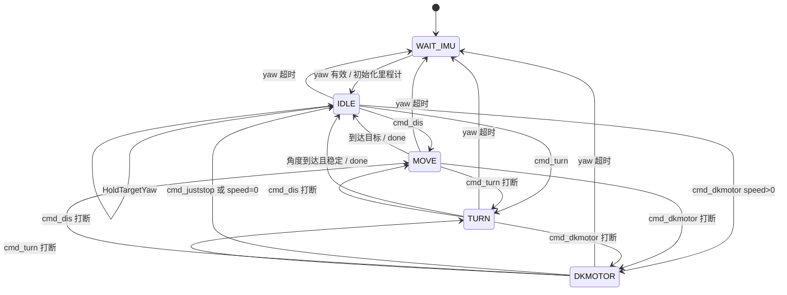

任务入口：

```text
AppChassisTask_Task(yaw_valid, yaw_deg, gyro_valid, gyro_z_deg_s)
```

基本逻辑：

- yaw 无效时进入 `WAIT_IMU`，并停止底盘。
- 第一次拿到有效 yaw 时初始化里程计，并进入 `IDLE`。
- 后续每轮调用 `BspChassisOdom_Update(yaw_deg)` 更新当前位置。
- 如果 `cmd_conmotion 0` 或 `BNO_KEY` 长按禁用了运动，则停电机并保持在 `IDLE`，不执行转向环。
- 如果运动使能，则按当前模式执行。

各模式行为：

- `IDLE`：调用 `HoldTargetYaw()`，也就是车不平移，但保持目标车头方向。
- `MOVE`：按起点到目标点的线段走。代码会根据线段方向计算沿线速度和横向纠偏速度，尽量保证走直线。
- `TURN`：只控制 yaw，达到目标角度并稳定停车后产生 `done`。
- `DKMOTOR`：
  - `head_lock = 1`：锁住命令发出瞬间的 yaw，按给定运动角度平移，使用带 gyro 反馈的角度环。
  - `head_lock = 0`：先转到目标角度，再向车头前方直行。
  - 该模式没有加减速规划，使用轮速闭环和车头角度保持。

重要接口：

- `AppChassisTask_CommandDistanceCm()`：记录当前位置作为起点，设置目标 `x/y`，并保存 `cmd_dis` 的速度曲线档位。
- `AppChassisTask_CommandTurnDeg()`：设置目标 yaw。
- `AppChassisTask_CommandDkMotor()`：设置持续运动速度、方向、锁头模式。
- `AppChassisTask_CommandJustStop()`：清持续运动速度，回到 `IDLE`，继续保持转向环。
- `AppChassisTask_SetMotionEnabled()`：整体使能/失能底盘运动。
- `AppChassisTask_OnYawZero()`：yaw 归零后重置里程计和目标 yaw。

## 底盘运动控制逻辑

底盘运动学和闭环在 `Bsp/Src/bsp_chassis.c`。

底盘控制有两类接口：

- 开环电流接口：直接把前后、左右、旋转电流混控到 4 个底盘电机。
- 轮速闭环接口：将车体速度或极坐标速度换算成四轮目标 rpm，再用每个电机的速度 PID 输出电流。

四轮混控关系：

```text
motor1 =  forward - left - ccw
motor2 =  forward + left - ccw
motor3 = -forward + left - ccw
motor4 = -forward - left - ccw
```

轮速闭环：

```text
目标车体速度/角速度
  -> 四轮目标 rpm
  -> 读取 CAN 反馈 speed_rpm
  -> 每轮 PID + 前馈
  -> 电流限幅
  -> BspMotor_SendChassisCurrents()
```

轮速闭环数据图：

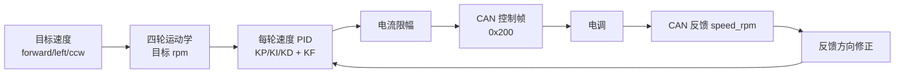

转向环：

- 目标 yaw 与当前 yaw 先计算最短角度误差。
- `BspChassis_CalcAngleSpeedGyro()` 根据 yaw 误差和 gyro z 反馈计算旋转 rpm。
- `BspChassis_SetBodySpeedAngleHoldGyro()` 把平移速度和旋转保持合成到底盘四轮目标速度。

走直线相关逻辑：

- `cmd_dis` 的直线移动在 App 层维护线段起点和终点。
- 每轮根据当前位置投影到线段方向，计算沿线进度和横向误差。
- 横向误差通过 `APP_CHASSIS_TASK_LINE_CROSS_KP` 转成横向纠偏速度。
- 底层 `BSP_CHASSIS_FORWARD_TO_LEFT_COMP` 和 `BSP_CHASSIS_LEFT_TO_FORWARD_COMP` 用于补偿前后/左右方向耦合。

## 里程计逻辑

里程计在 `Bsp/Src/bsp_chassis_odom.c`。

输入：

- 四个底盘电机的 CAN 反馈速度 `speed_rpm`。
- BNO085 提供的当前 yaw。

计算流程：

```text
motor rpm
  -> 按电机反馈方向修正
  -> 计算 body_forward_rpm / body_left_rpm
  -> rpm 转 mm/s
  -> 根据 yaw 转换到世界坐标 vx/vy
  -> x/y 积分
```

里程计计算图：

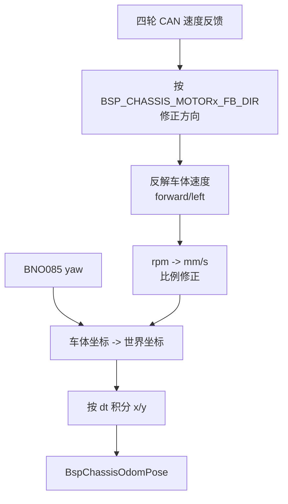

坐标约定：

- `x_mm/y_mm` 是世界坐标位置。
- `body_forward_mm_s/body_left_mm_s` 是车体坐标速度。
- yaw 由 BNO085 提供，里程计只积分平移，不自己积分角度。

## 电机 CAN 逻辑

电机驱动在 `Bsp/Src/bsp_motor.c`。

CAN ID 约定：

- 电机反馈帧基准 ID：`0x200`，反馈 ID 通常为 `0x201` 到 `0x205`。
- 底盘 1-4 号电机控制帧：`0x200`。
- 功能电机 5 号控制帧：`0x1FF`。

发送控制：

- `BspMotor_SendChassisCurrents()` 打包 4 个底盘电机电流。
- `BspMotor_SendFunctionCurrent()` 打包第 5 个功能电机电流。
- 电流会被限制到 `BSP_MOTOR_C610_MAX_CURRENT`。

接收反馈：

- `HAL_CAN_RxFifo0MsgPendingCallback()` 在 CAN FIFO0 中断中读取所有待处理帧。
- `DecodeMotorFeedback()` 解析编码器、速度、电流、温度。
- 根据编码器跨圈变化维护 `round_count` 和 `total_ecd`。
- `BspMotor_IsOnline()` 根据反馈更新时间判断电机在线状态。

CAN 控制和反馈图：

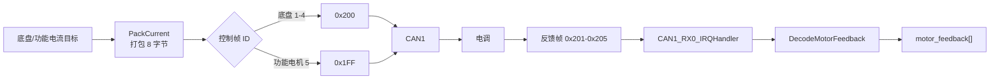

## BNO085 IMU 逻辑

BNO085 驱动在 `Bsp/Src/bsp_bno085.c`，使用 I2C1。

主要职责：

- 探测地址 `0x4B` / `0x4A`。
- 通过 SHTP 协议读写 BNO085 数据包。
- 获取产品信息。
- 开启默认报告。
- 解析旋转向量和陀螺仪数据。

主循环只关心两个结果：

- `Bno085_GetYawDegrees()` 得到 yaw 角。
- `gyro.z` 转为 `deg/s` 后给底盘转向环使用。

yaw 归零和运动使能按键：

- `BNO_KEY` 短按释放时，主循环调用 `Main_ResetYawZero()`。
- `BNO_KEY` 长按超过 `MAIN_ZERO_KEY_LONG_PRESS_MS` 时，调用 `AppChassisTask_SetMotionEnabled()` 切换底盘运动使能。
- 长按失能后，新的 `cmd_dis`、`cmd_turn`、`cmd_dkmotor` 等底盘运动命令会返回 `busy`；再次长按可恢复。
- 串口 `cmd_anglecal` 也调用同一个函数。
- 归零后会更新 BNO085 yaw 零点，并通知底盘任务重置目标 yaw 和里程计。

BNO085 到底盘转向环图：

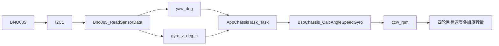

## BE-1732 红外传感器逻辑

BE-1732 驱动在 `Bsp/Src/bsp_be1732.c`，使用 I2C2。

初始化：

- 先执行 I2C2 总线恢复：释放 PB10/PB11，给 SCL 9 个脉冲，再重新初始化 I2C2。
- 检查设备是否 ready。
- 默认设置为调制检测模式 `tz`。

读取策略：

1. 优先使用 `HAL_I2C_Mem_Read()`，把传感器命令当 8 位寄存器地址读取。
2. 如果失败，尝试 `Master_Transmit(command) + Master_Receive(value)`。
3. 再失败时，尝试直接 `Master_Receive()`。
4. 遇到 busy 会尝试恢复总线。

串口命令：

- `cmd_infred`：调用 `BspBe1732_ReadFilteredChannel()`，正常返回 `1-7` 中最强红外通道；最大光值连续 30 次 `<=4` 时返回 `-1`。
- `cmd_redzhi`：调用 `BspBe1732_ReadStrongestValue()`，返回当前最大光值。
- `cmd_xgred value`：调用 `BspBe1732_SetNoBallValueThreshold()`，修改无红外判断阈值并保存到 Flash sector 7。
- `cmd_infred_mode pt`：切换普通检测模式。
- `cmd_infred_mode tz`：切换调制检测模式。

失败时协议会返回 HAL 状态和 I2C 错误码，便于现场排查。

BE-1732 读取流程图：

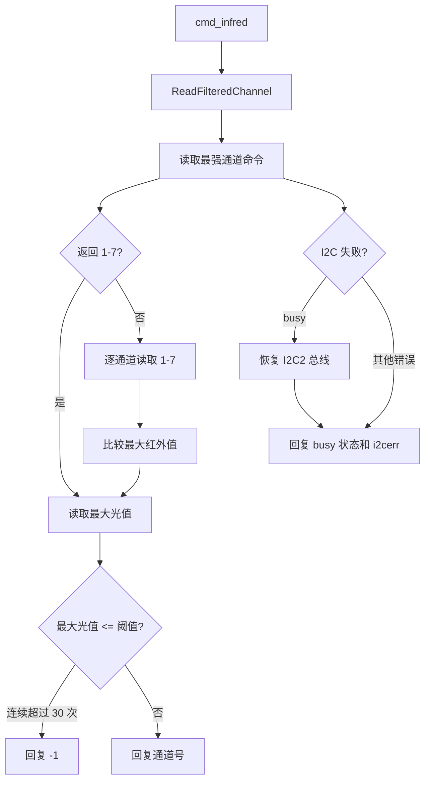

## 吸力电机逻辑

吸力电机驱动在 `Bsp/Src/bsp_suction_motor.c`，使用 TIM4 CH1 PWM。

控制方式：

- 初始化脉宽默认 `1000 us`。
- 运行范围从 `1050 us` 到 `2000 us`。
- `cmd_suck 0` 会回到初始化脉宽。
- `cmd_suck 1-100` 会线性映射到运行脉宽范围。

数据流：

```text
cmd_suck speed
  -> AppPiComm
  -> BspSuctionMotor_SetSpeedPercent()
  -> __HAL_TIM_SET_COMPARE(&htim4, TIM_CHANNEL_1, pulse_us)
```

吸力电机映射图：

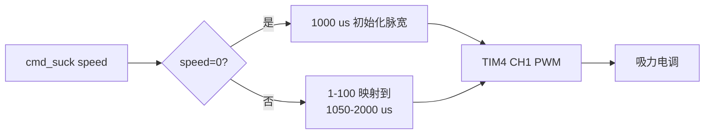

## 吸球检测逻辑

吸球检测驱动在 `Bsp/Src/bsp_suction_detect.c`，使用 PB15/xqwd 普通 GPIO 输入。

控制方式：

- PB15 已由 CubeMX 配置为上拉输入。
- 默认 `BSP_SUCTION_DETECT_ACTIVE_LEVEL` 为 `GPIO_PIN_RESET`，微动开关闭合拉低时表示吸到球。
- 如硬件为高电平有效，可在编译宏中把 `BSP_SUCTION_DETECT_ACTIVE_LEVEL` 改为 `GPIO_PIN_SET`。
- `cmd_xqcx` 调用 `BspSuctionDetect_IsBallDetected()`，返回 `cmd_xqcx 1` 或 `cmd_xqcx 0`。

数据流：

```text
cmd_xqcx
  -> AppPiComm
  -> BspSuctionDetect_IsBallDetected()
  -> HAL_GPIO_ReadPin(xqwd_GPIO_Port, xqwd_Pin)
  -> PB15/xqwd 微动开关
```

## 继电器逻辑

继电器接口在 `Bsp/Src/bsp_dct.c`，使用 PD0/JD1 普通 GPIO 输出。

控制方式：

- `BspDct_Init()` 默认关闭继电器。
- `cmd_dct 0` 调用 `BspDct_SetEnabled(0)`，PD0 输出低电平。
- `cmd_dct 1` 调用 `BspDct_SetEnabled(1)`，PD0 输出高电平。
- `BspDct_GetEnabled()` 返回软件缓存的继电器状态。

数据流：

```text
cmd_dct 0/1
  -> AppPiComm
  -> BspDct_SetEnabled()
  -> HAL_GPIO_WritePin(JD1_GPIO_Port, JD1_Pin, ...)
  -> PD0/JD1 继电器接口
```

继电器控制图：

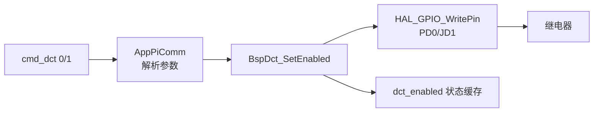

## USART 逻辑

串口 BSP 在 `Bsp/Src/bsp_usart.c`。

- `BSP_USART_1` 映射到 `huart1`。
- `BSP_USART_6` 映射到 `huart6`。
- `BspUsart_Transmit()` 封装阻塞发送。
- `Printf()` 基于 `vsnprintf()` 和 `BspUsart_Transmit()` 实现。

当前约定：

- 上位机命令和传感器协议回复走 USART6。
- `MAIN_DEBUG_USART` 默认仍是 USART1；如果只连接 USART6，需要注意调试信息不一定能看到。

## 关键数据流

### 上位机控制底盘

```text
上位机
  -> USART6: cmd_xxx *CRC
  -> AppPiComm 校验 CRC / 解析参数
  -> AppChassisTask_CommandXxx()
  -> AppChassisTask_Task()
  -> BspChassis_SetBodySpeed...()
  -> BspMotor_SendChassisCurrents()
  -> CAN1
  -> 电调/电机
```

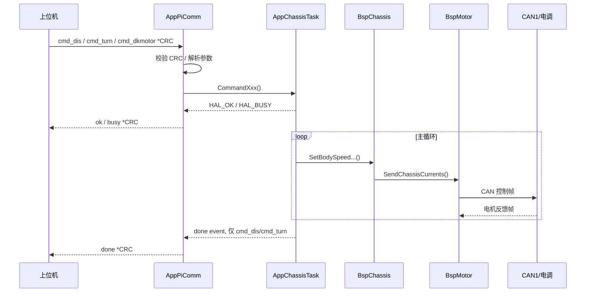

### 电机反馈到控制闭环

```text
电调反馈 CAN 帧
  -> CAN1_RX0_IRQHandler()
  -> HAL_CAN_RxFifo0MsgPendingCallback()
  -> BspMotor motor_feedback[]
  -> BspChassis 轮速 PID
  -> BspChassisOdom 里程计积分
```

### IMU 到底盘转向环

```text
BNO085
  -> I2C1
  -> Bno085_ReadSensorData()
  -> yaw_deg / gyro_z_deg_s
  -> AppChassisTask_Task()
  -> BspChassis_CalcAngleSpeedGyro()
  -> 四轮目标速度叠加旋转分量
```

### 红外传感器到串口回复

```text
USART6: cmd_infred *CRC
  -> AppPiComm
  -> BspBe1732_ReadFilteredChannel()
  -> I2C2 读取 BE-1732 最强通道和最大光值
  -> USART6: cmd_infred <channel> *CRC
```

## 中断与主循环职责划分

中断中做轻量工作：

- USART6 RX 完成中断：只存入环形缓冲区并重启接收。
- CAN RX FIFO0 中断：读取反馈帧并更新电机反馈缓存。
- I2C 中断入口由 HAL 处理，但当前 BNO085/BE1732 读写主要是阻塞式 HAL 调用。

主循环中做耗时或状态机工作：

- 串口命令行解析和回复。
- I2C 传感器读取。
- 底盘运动状态机。
- 吸力电机测试任务。
- 继电器等 GPIO 输出控制命令。

调度关系图：

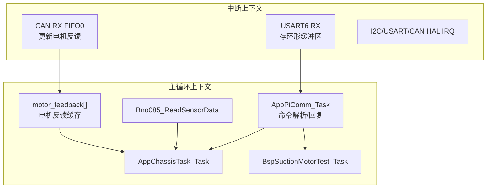

## 维护注意点

- 串口协议回复应统一使用 `SendPayloadWithCrc()` 或 `SendCommandStateReply()`，避免忘记 CRC。
- 新增串口命令时，应同时更新 README 和本文档中的命令逻辑说明。
- 会持续运动的命令不应产生 `done`，否则上位机会误判任务完成。
- 底盘运动相关接口要检查 `app_motion_enabled` 和 `app_odom_ready`，否则容易在 IMU 未就绪时输出错误控制。
- 修改底盘电机方向时，同时检查 `BSP_CHASSIS_MOTORx_DIR` 和 `BSP_CHASSIS_MOTORx_FB_DIR`。
- 调直线时优先看三类参数：里程计比例、前后/左右耦合补偿、线段横向纠偏参数。
- BE-1732 出现 `HAL_BUSY` 或 I2C 错误时，优先检查 I2C2 总线、上拉、地址和传感器供电。
- 只连接 USART6 时，协议回复能看到；但 `MAIN_DEBUG_USART` 默认 USART1 的调试输出看不到。
